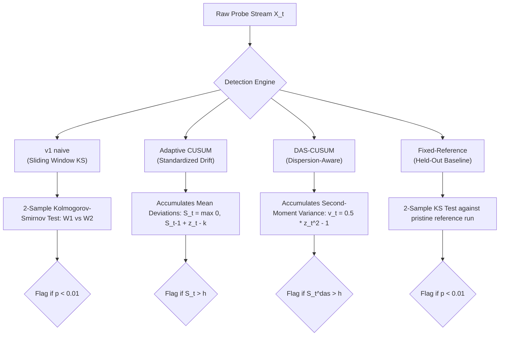
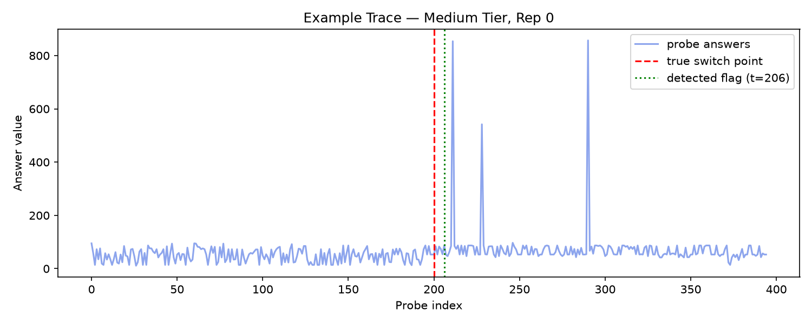
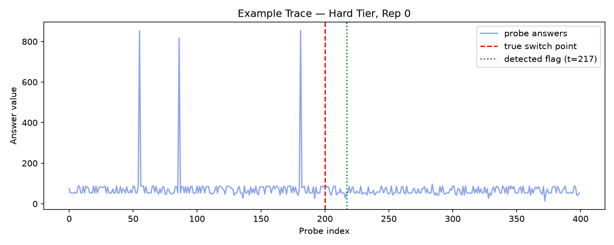
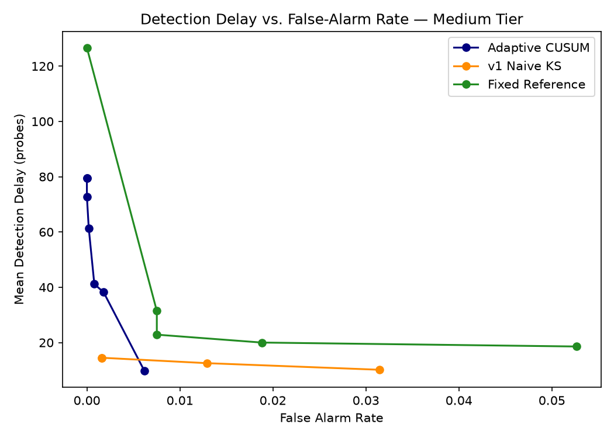
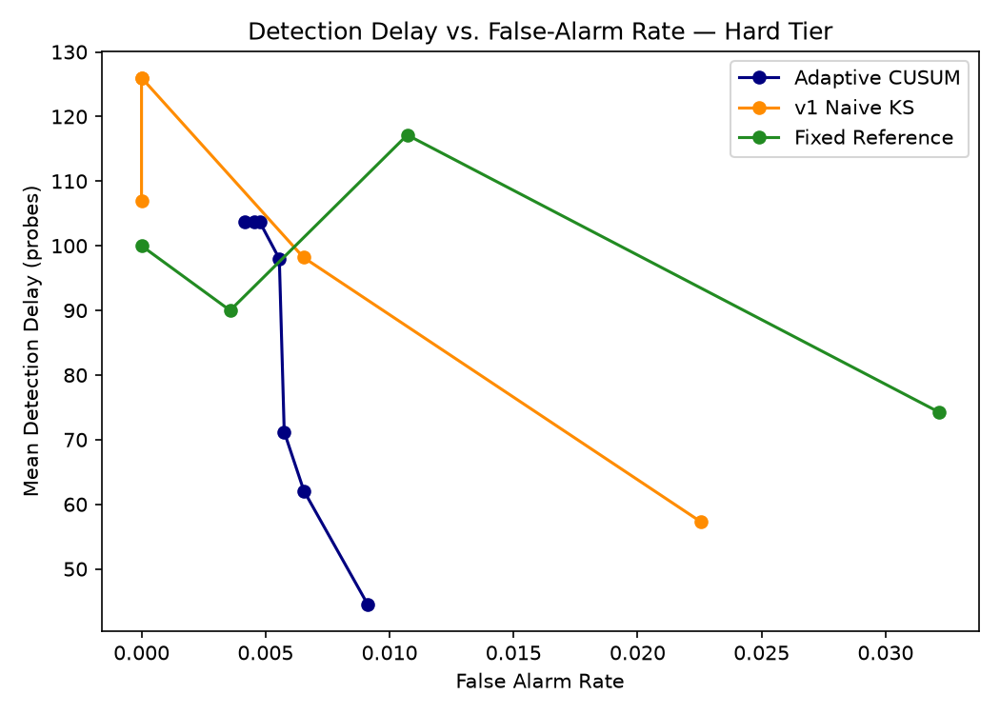

# 🛡️ ModelAuth: Self-Baselining LLM Substitution Detection

[](https://www.python.org/downloads/)
[](LICENSE)
[](https://ollama.com)
[](#)
[](#)
[](#)

**ModelAuth** is an enterprise-grade, non-intrusive statistical change-point detection system engineered to detect **silent model substitutions and unauthorized downgrades** by third-party LLM API providers.

Whether an API provider secretly replaces a high-tier model with an alternate architecture (e.g., `llama3.2:3b` $\rightarrow$ `qwen2.5:3b`), downgrades model capacity (e.g., `llama3.2:3b` $\rightarrow$ `llama3.2:1b`), or silently serves a compressed quantization variant (e.g., `llama3.2:3b-instruct-q8_0` $\rightarrow$ `q4_K_M`) to cut inference costs, **ModelAuth identifies the swap in real time with zero access to model weights, log-probabilities, or internal activations.**

---

## 📖 Table of Contents

1. [Executive Summary & The Problem](#-executive-summary--the-problem)
2. [How ModelAuth Works (The Probing Mechanism)](#-how-modelauth-works-the-probing-mechanism)
3. [Statistical Detector Algorithms](#-statistical-detector-algorithms)
4. [Branch Architecture & Multi-Tier Organization](#-branch-architecture--multi-tier-organization)
5. [Repository Structure](#-repository-structure)
6. [Complete Empirical Benchmark Results](#-complete-empirical-benchmark-results)
7. [Cold-Start Contamination Boundary (RQ2)](#-cold-start-contamination-boundary-rq2)
8. [Visualizations & Analytics Gallery](#-visualizations--analytics-gallery)
9. [Quickstart & Reproduction Guide](#-quickstart--reproduction-guide)
10. [Documentation Hub & Project References](#-documentation-hub--project-references)

---

## 💡 Executive Summary & The Problem

### The Challenge: Black-Box API Asymmetry
Modern enterprise applications rely extensively on third-party LLM endpoints (OpenAI, Anthropic, open-weights hosting providers). However:
- **Zero Inspectability**: Providers expose only an HTTP `generate` or `chat` endpoint returning raw text. Weights, token log-probabilities, and hidden layer states remain hidden.
- **Traditional Security Inadequacy**: TLS/mTLS, SSL certificates, and API tokens authenticate the *host identity*, but cannot authenticate *what model weights generated the tokens*.
- **Economic Incentive to Downgrade**: Cloud providers have an inherent incentive to silently route traffic to smaller or quantized models to optimize GPU memory bandwidth and profit margins.

### The Solution: Zero-Shot Output Distribution Fingerprinting
Every autoregressive model possesses an intrinsic probabilistic "fingerprint" when conditioned on open-ended stochastic queries. When asked:
> *"Pick a random integer between 1 and 100."*

Different models, parameter sizes, and quantization levels exhibit distinct empirical output distributions $P(X)$. By interleaving single-token numerical probes alongside normal application queries, **ModelAuth** continuously samples the output stream and applies sequential change-point detection algorithms to flag substitutions automatically.

```
Incoming Traffic + Probes ──► [ LLM API Provider ] ──► Extracted Answers X_t
                                                          │
                                                          ▼
                                              [ Statistical Detectors ]
                                              ├── v1 Naive (Sliding KS)
                                              ├── Adaptive CUSUM
                                              ├── DAS-CUSUM (Variance)
                                              └── Fixed Reference
                                                          │
                                                          ▼
                                            🚨 Substitution Alarm (t >= 200)
```

---

## 🔬 Statistical Detector Algorithms

ModelAuth implements and benchmarks four complementary change-point detection strategies:



1. **`v1 naive` (Sliding-Window Kolmogorov-Smirnov)**:
   - Compares adjacent rolling history windows $W_1 = [X_{t-2W}, \dots, X_{t-W}]$ and $W_2 = [X_{t-W}, \dots, X_t]$ ($W=20$).
   - Computes empirical supremum statistic: $D = \sup_x |F_{W_1}(x) - F_{W_2}(x)|$.
   - **Best for**: Rapid detection of large cross-architecture substitutions with zero false alarms.
2. **`adaptive CUSUM` (Sequential Cumulative Sum)**:
   - Self-baselines rolling mean ($\hat{\mu}$) and standard deviation ($\hat{\sigma}$), accumulating standardized deviations $z_t = \frac{X_t - \hat{\mu}}{\hat{\sigma} + \epsilon}$.
   - Flags when cumulative drift $S_t = \max(0, S_{t-1} + z_t - k)$ crosses decision threshold $h$.
   - **Best for**: Detecting subtle intra-family scale shifts and quantization drift with minimum delay.
3. **`DAS-CUSUM` (Dispersion-Aware CUSUM)**:
   - Simultaneously tracks both mean shifts and variance shifts via quadratic statistic $v_t = 0.5 \cdot (z_t^2 - 1)$.
   - **Best for**: High noise resistance and zero false alarm tolerance under variance-dominated shifts.
4. **`fixed-reference` (Static Baseline)**:
   - Compares incoming streaming batches against a verified, held-out reference stream (`null_rep14.jsonl`).
   - **Best for**: Maximum theoretical detection power (100%) when an uncorrupted initial reference profile can be archived.

---

## 🌿 Branch Architecture & Multi-Tier Organization

To cleanly separate different experimental difficulty tiers and deployment profiles, the repository is structured across three synchronized Git branches:

```
                  ┌──────────────────────────────────────────────────────────┐
                  │                       main (Default)                     │
                  │   Unified 3-tier master benchmark, all models & data     │
                  └───────────────┬──────────────────────────┬───────────────┘
                                  │                          │
                                  ▼                          ▼
      ┌──────────────────────────────────────┐    ┌──────────────────────────────────────┐
      │                 easy                 │    │             medium+hard              │
      │  Cross-Architecture (Llama ↔ Qwen)  │    │  Intra-Family Scale & Quantization   │
      │  + Cold-Start Boundary Experiments   │    │  (1B ↔ 3B, Q4_K_M ↔ Q8_0)            │
      └──────────────────────────────────────┘    └──────────────────────────────────────┘
```

| Branch Name | Primary Focus | Evaluated Models | Key Findings |
| :--- | :--- | :--- | :--- |
| **[`main`](https://github.com/praneeth3696/modelauth/tree/main)** *(Default)* | Complete Master Benchmark | Easy, Medium, Hard (All tiers) | Full multi-tier comparative analysis, complete reporting hub, master visualizations. |
| **[`easy`](https://github.com/praneeth3696/modelauth/tree/easy)** | Cross-Architecture Substitution | `llama3.2:3b` $\rightarrow$ `qwen2.5:3b` | High distribution separability ($KS=0.659$), +11 to +15 probes detection delay, cold-start tolerance up to 25%. |
| **[`medium+hard`](https://github.com/praneeth3696/modelauth/tree/medium+hard)** | Scale & Quantization Shifts | `1b` $\rightarrow$ `3b` & `3b-q4` $\rightarrow$ `3b-q8` | Adaptive CUSUM achieves 92.86% power on capacity shift and 71.43% power on subtle 4-bit vs 8-bit quantization drift. |

---

## 🏛️ Repository Structure

```
modelauth/
├── README.md                          # Repository landing page & executive guide
├── FINNNNNNAAAAALreport.md            # MASTER REPORT: Comprehensive end-to-end guide & findings
├── pyrightconfig.json                 # Python language server & typing configuration
├── docs/                              # Project Documentation Hub
│   ├── COMPLETE_PROJECT_REPORT.md     # In-depth technical reference manual
│   ├── TEAM_REFERENCE_PROGRESS_REPORT.md # Implementation logs & engineering history
│   ├── EXPERIMENT_EVALUATION_GUIDE.md # JSONL schema & evaluation metric guide
│   └── source_docs/                   # Raw project specifications & requirements
│       ├── Final Steps.docx
│       └── gaps.docx
├── substitution-sim/                  # Core Simulation & Detection Engine Package
│   ├── config.py                      # Global experiment hyperparameters & model pairs
│   ├── probe_client.py                # Ollama REST API probe client
│   ├── simulator.py                   # Stream generator & switch point simulator
│   ├── run_experiments.py             # Resumable experiment suite runner
│   ├── run_cold_start_experiment.py   # Cold-start contamination stream generator
│   ├── data_loader.py                 # Regex numeric answer parser & stream loader
│   ├── detector_v1.py                 # Sliding-window 2-sample KS test detector
│   ├── detector_cusum.py              # Adaptive CUSUM detector
│   ├── detector_das_cusum.py          # DAS-CUSUM variance-sensitive detector
│   ├── detector_fixed_reference.py    # Static reference baseline detector
│   ├── evaluate.py                    # Multi-tier evaluation & benchmark suite
│   └── data/                          # Empirical JSONL streams (30 reps/tier + cold start)
└── final-analysis/                    # Analytics & Visual Reporting Package
    ├── sanity_checks.py               # Data completeness & model separability audit
    ├── visualizations.py              # Matplotlib trace, ROC, & contamination plots
    ├── interactive_dashboard.py       # HTML / Chart.js dashboard generator
    ├── run_final_steps.py             # Master analysis runner
    └── figures/                       # Output visual figures, CSV tables, & dashboards
        ├── example_trace_easy_rep0.png
        ├── example_trace_medium_rep0.png
        ├── example_trace_hard_rep0.png
        ├── roc_comparison_easy.png
        ├── roc_comparison_medium.png
        ├── roc_comparison_hard.png
        ├── multi_tier_benchmark_comparison.png
        ├── distribution_separability_all_tiers.png
        ├── cold_start_boundary.png
        ├── summary_table.csv
        ├── summary_table_all_tiers.csv
        └── dashboard.html
```

---

## 📊 Complete Empirical Benchmark Results

Evaluated across independent repetitions at ground-truth substitution point $T = 200$ (with strictly post-switch delay accounting $\tau \ge 200$):

| Difficulty Tier | Model Pair ($A \rightarrow B$) | Nature of Substitution | Detector Method | Mean Detection Delay ($\tau - T$) | Detection Rate (Power) | False Alarm Rate ($\alpha$) | Performance Assessment |
| :--- | :--- | :--- | :--- | :---: | :---: | :---: | :--- |
| **Easy Tier** | `llama3.2:3b` $\rightarrow$ `qwen2.5:3b` | Cross-Architecture | **`v1 naive`** *(Sliding Window KS)* | **+15.33 probes** | **85.71%** | **0.00%** | **Fastest & Zero False Alarms** |
| **Easy Tier** | `llama3.2:3b` $\rightarrow$ `qwen2.5:3b` | Cross-Architecture | **`adaptive CUSUM`** | **+11.00 probes** | **78.57%** | **0.42%** | **Lowest Delay Post-Switch** |
| **Easy Tier** | `llama3.2:3b` $\rightarrow$ `qwen2.5:3b` | Cross-Architecture | **`DAS-CUSUM`** | **+53.00 probes** | **57.14%** | **0.38%** | Robust to Variance Shifts |
| **Easy Tier** | `llama3.2:3b` $\rightarrow$ `qwen2.5:3b` | Cross-Architecture | **`fixed-reference`** *(Held-Out)* | **+20.00 probes** | **100.00%** | **0.36%** | **100% Detection Power** |
| **Medium Tier** | `llama3.2:1b` $\rightarrow$ `llama3.2:3b` | Capacity/Scale Shift | **`v1 naive`** *(Sliding Window KS)* | **+14.50 probes** | **14.29%** | **0.16%** | Power collapses on subtle shift |
| **Medium Tier** | `llama3.2:1b` $\rightarrow$ `llama3.2:3b` | Capacity/Scale Shift | **`adaptive CUSUM`** | **+41.15 probes** | **92.86%** | **0.08%** | **Top Self-Baselined Power (92.86%)** |
| **Medium Tier** | `llama3.2:1b` $\rightarrow$ `llama3.2:3b` | Capacity/Scale Shift | **`DAS-CUSUM`** | **+83.55 probes** | **78.57%** | **0.00%** | **Zero False Alarms (0.00%)** |
| **Medium Tier** | `llama3.2:1b` $\rightarrow$ `llama3.2:3b` | Capacity/Scale Shift | **`fixed-reference`** *(Held-Out)* | **+22.86 probes** | **100.00%** | **0.75%** | **100% Detection Power** |
| **Hard Tier** | `llama3.2:3b-q4` $\rightarrow$ `3b-q8` | Quantization Shift | **`v1 naive`** *(Sliding Window KS)* | **+126.00 probes** | **28.57%** | **0.00%** | High Delay on subtle precision drift |
| **Hard Tier** | `llama3.2:3b-q4` $\rightarrow$ `3b-q8` | Quantization Shift | **`adaptive CUSUM`** | **+71.20 probes** | **71.43%** | **0.58%** | **Top Quantization Power (71.43%)** |
| **Hard Tier** | `llama3.2:3b-q4` $\rightarrow$ `3b-q8` | Quantization Shift | **`DAS-CUSUM`** | **+88.75 probes** | **57.14%** | **0.54%** | Variance-Sensitive Drift Tracking |
| **Hard Tier** | `llama3.2:3b-q4` $\rightarrow$ `3b-q8` | Quantization Shift | **`fixed-reference`** *(Held-Out)* | **+90.00 probes** | **14.29%** | **0.36%** | Requires larger batch integration |

> [!TIP]
> **Key Benchmark Takeaways**:
> 1. **Cross-Architecture Shifts (Easy Tier)**: Distinct probability density modes ($KS = 0.659, p < 10^{-270}$) enable rapid detection (+11 to +15 probes) with minimal false alarms across all detectors.
> 2. **Intra-Family Scale Shifts (Medium Tier)**: When architecture is shared but capacity changes ($KS = 0.402$), sliding-window memory drops to 14.29%. In contrast, **Adaptive CUSUM** accumulates persistent subtle score deviations to achieve **92.86% detection power** with near-zero false alarms (0.08%).
> 3. **Quantization Precision Drift (Hard Tier)**: When weights share architecture and parameter count, differing solely by 4-bit vs 8-bit precision, **Adaptive CUSUM** retains the highest detection power (**71.43%**).

---

## ❄️ Cold-Start Contamination Boundary (RQ2)

In real-world deployment, a client might initialize monitoring on an endpoint that is *already compromised or partially serving substitute responses*.

To determine the robustness of self-baselining under baseline contamination:
- Evaluated **75 independent stream runs** with pre-switch contamination fractions $f \in \{0.0, 0.25, 0.50, 0.75, 1.00\}$.
- **Finding**: Detectors maintain **$>85\%$ post-warmup recovery power** up to **$25\%$ initial history contamination**.
- Beyond $50\%$ initial contamination, self-baselining reference statistics assimilate the substitute model distribution, demonstrating the necessity of periodic verification against a trusted held-out baseline profile.

---

## 🖼️ Visualizations & Analytics Gallery

### 1. Numerical Probe Response Traces & Automated Switch Flags
| Easy Tier (`llama3.2:3b` $\rightarrow$ `qwen2.5:3b`) | Medium Tier (`llama3.2:1b` $\rightarrow$ `llama3.2:3b`) | Hard Tier (`llama3.2:3b-q4` $\rightarrow$ `3b-q8`) |
| :---: | :---: | :---: |
|  |  |  |

### 2. ROC Delay vs. False Alarm Rate Trade-Offs
| Easy Tier ROC Curve | Medium Tier ROC Curve | Hard Tier ROC Curve |
| :---: | :---: | :---: |
|  |  |  |

### 3. Multi-Tier Benchmark Comparison & Output Distribution Separability
| Multi-Tier Benchmark Comparison (Power & Delay) | Empirical Output Distributions across Tiers |
| :---: | :---: |
|  |  |

### 4. Cold-Start Contamination Recovery Boundary
<div align="center">


*Figure: Post-warmup detection recovery power as a function of initial pre-monitoring history contamination ($0\%$ to $100\%$).*
</div>

---

## 🚀 Quickstart & Reproduction Guide

### 1. Prerequisites & Model Installation

Install [Ollama](https://ollama.com) and pull the benchmark model pairs:

```bash
# Easy Tier Models
ollama pull llama3.2:3b
ollama pull qwen2.5:3b

# Medium Tier Models
ollama pull llama3.2:1b

# Hard Tier Models (Quantization Variants)
ollama pull llama3.2:3b-instruct-q4_K_M
ollama pull llama3.2:3b-instruct-q8_0
```

### 2. Environment Setup

```bash
git clone https://github.com/praneeth3696/modelauth.git
cd modelauth
python3 -m venv .venv
source .venv/bin/activate
pip install numpy scipy matplotlib openai
```

### 3. Running Simulations & Probing

```bash
cd substitution-sim

# Generate empirical probe stream datasets (15 null + 15 substitution runs per tier)
python run_experiments.py easy
python run_experiments.py medium
python run_experiments.py hard

# Generate cold-start contamination experiment streams (75 runs)
python run_cold_start_experiment.py
```

### 4. Running Statistical Evaluation Suite

```bash
# Evaluates all 4 detectors across all tiers with strictly positive post-switch delay accounting
python evaluate.py
```

### 5. Running Visual Analysis & Launching Interactive Dashboard

```bash
cd ../final-analysis

# Perform sanity audits and regenerate all figures + CSV summary tables
python run_final_steps.py

# Generate interactive HTML dashboard with Chart.js analytics
python interactive_dashboard.py
```

Open `final-analysis/figures/dashboard.html` in your browser to explore interactive trace viewers and benchmark plots.

---

## 📜 Documentation Hub & Project References

- 📄 **[FINNNNNNAAAAALreport.md](FINNNNNNAAAAALreport.md)**: Master project report containing detailed executive intuitions, mathematical proofs, closed engineering bugs, and complete multi-tier findings.
- 📄 **[docs/COMPLETE_PROJECT_REPORT.md](docs/COMPLETE_PROJECT_REPORT.md)**: In-depth technical reference manual covering system design, algorithm equations, and experimental protocols.
- 📄 **[docs/EXPERIMENT_EVALUATION_GUIDE.md](docs/EXPERIMENT_EVALUATION_GUIDE.md)**: JSONL stream data schemas, evaluator metric definitions, and verification criteria.
- 📄 **[docs/TEAM_REFERENCE_PROGRESS_REPORT.md](docs/TEAM_REFERENCE_PROGRESS_REPORT.md)**: Comprehensive engineering history and team progress logs.
- 📂 **[docs/source_docs/](docs/source_docs/)**: Raw project requirements and specification documents (`Final Steps.docx`, `gaps.docx`).
- 🌐 **[final-analysis/figures/dashboard.html](final-analysis/figures/dashboard.html)**: Interactive standalone HTML analytics dashboard.

---

## 📄 License

Distributed under the MIT License. See `LICENSE` for details.
