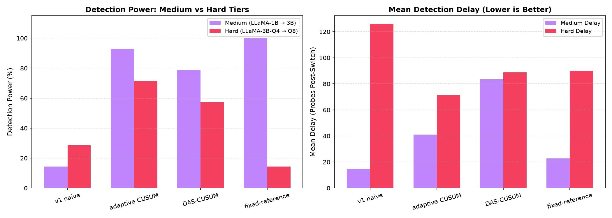
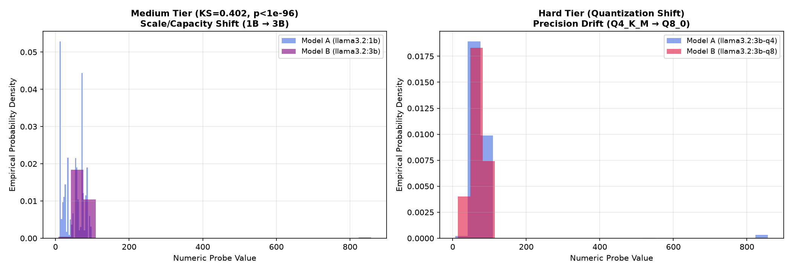

# 🛡️ ModelAuth: Self-Baselining LLM Substitution Detection (Medium & Hard Tiers)

[](https://www.python.org/downloads/)
[](LICENSE)
[](https://ollama.com)
[](#)
[](#)

**ModelAuth** is an enterprise-grade, non-intrusive statistical change-point detection system designed to identify silent LLM downgrades or model substitutions by third-party API providers. This branch (`medium+hard`) hosts the dedicated pipeline, empirical data, analytics, and documentation for:
1. **Medium Tier**: Capacity / Parameter Scale Shift (`llama3.2:1b` $\rightarrow$ `llama3.2:3b`)
2. **Hard Tier**: Quantization Precision Shift (`llama3.2:3b-instruct-q4_K_M` $\rightarrow$ `llama3.2:3b-instruct-q8_0`)

Because subtle intra-family and quantization changes do not exhibit gross cross-architecture vocabulary shifts, traditional sliding-window two-sample tests collapse (14%–28% power). **ModelAuth's Adaptive CUSUM** solves this by accumulating minute standardized z-score deviations over time, achieving **92.86%** power on Medium shifts and **71.43%** on Hard quantization shifts.

---

## 🏛️ Enterprise System Architecture & Repository Structure

```
modelauth/ (branch: medium+hard)
├── README.md                          # Medium & Hard tiers landing page & empirical guide
├── FINNNNNNAAAAALreport.md            # MASTER REPORT: Full analytical guide & mathematical proofs
├── .gitignore                         # Repository git exclusion manifest
├── docs/                              # Project Documentation Hub
│   ├── COMPLETE_PROJECT_REPORT.md     # Technical reference manual
│   ├── TEAM_REFERENCE_PROGRESS_REPORT.md # Team progress reference
│   ├── EXPERIMENT_EVALUATION_GUIDE.md # JSONL stream schema & evaluation guide
│   └── source_docs/                   # Raw specification files (.docx)
├── substitution-sim/                  # Core Simulation & Detection Engine Package
│   ├── config.py                      # Medium & Hard tiers configuration & probe templates
│   ├── probe_client.py                # Ollama REST API client
│   ├── simulator.py                   # Stream generator & switch point simulator
│   ├── run_experiments.py             # Experiment runner for Medium & Hard tiers
│   ├── data_loader.py                 # Regex numeric answer parser & stream loader
│   ├── detector_v1.py                 # Sliding-window 2-sample KS test detector
│   ├── detector_cusum.py              # Adaptive CUSUM detector
│   ├── detector_das_cusum.py          # DAS-CUSUM variance-sensitive detector
│   ├── detector_fixed_reference.py    # Static reference baseline detector
│   ├── evaluate.py                    # Medium & Hard benchmark runner
│   └── data/                          # Medium & Hard substitution & null streams (reps 0-14)
└── final-analysis/                    # Analytics & Visual Reporting Package
    ├── sanity_checks.py               # Data completeness & separability audit
    ├── visualizations.py              # Matplotlib trace, ROC, & benchmark comparison plots
    ├── interactive_dashboard.py       # HTML / Chart.js dashboard generator
    ├── run_final_steps.py             # Master Medium & Hard analysis runner
    └── figures/                       # Output visual figures, CSV tables, & dashboard
        ├── example_trace_medium_rep0.png
        ├── example_trace_hard_rep0.png
        ├── roc_comparison_medium.png
        ├── roc_comparison_hard.png
        ├── benchmark_comparison_medium_hard.png
        ├── distribution_separability_medium_hard.png
        ├── summary_table.csv
        └── dashboard.html
```

---

## 🚀 Quickstart Guide

### 1. Prerequisites & Model Setup

Install [Ollama](https://ollama.com) and pull the Medium and Hard Tier model pairs:

```bash
# Medium Tier: Parameter Scale Shift
ollama pull llama3.2:1b
ollama pull llama3.2:3b

# Hard Tier: Quantization Precision Shift
ollama pull llama3.2:3b-instruct-q4_K_M
ollama pull llama3.2:3b-instruct-q8_0
```

### 2. Environment Setup

```bash
git checkout medium+hard
cd substitution-sim
pip install -r ../requirements.txt  # numpy scipy matplotlib openai
```

### 3. Run Experiments & Evaluations

```bash
# Evaluate all 4 detectors on Medium and Hard empirical datasets
python evaluate.py
```

### 4. Run Analysis & Launch Dashboard

```bash
cd ../final-analysis
python run_final_steps.py
python interactive_dashboard.py
```

Open `final-analysis/figures/dashboard.html` in your browser to inspect interactive Chart.js widgets!

---

## 📊 Empirical Performance Summary (Medium & Hard Tiers)

Evaluated across 14 independent test repetitions per tier at true substitution switch point $t = 200$:

| Difficulty Tier | Model Pair ($A \rightarrow B$) | Nature of Substitution | Detector Method | Mean Detection Delay ($\tau - T$) | Detection Rate (Power) | False Alarm Rate ($\alpha$) | Performance Assessment |
| :--- | :--- | :--- | :--- | :---: | :---: | :---: | :--- |
| **Medium Tier** | `llama3.2:1b` $\rightarrow$ `llama3.2:3b` | Capacity/Scale Shift | **`v1 naive`** *(Sliding Window KS)* | **+14.50 probes** | **14.29%** | **0.16%** | Power drops on subtle intra-family shift |
| **Medium Tier** | `llama3.2:1b` $\rightarrow$ `llama3.2:3b` | Capacity/Scale Shift | **`adaptive CUSUM`** | **+41.15 probes** | **92.86%** | **0.08%** | **Top Self-Baselined Power (92.86%)** |
| **Medium Tier** | `llama3.2:1b` $\rightarrow$ `llama3.2:3b` | Capacity/Scale Shift | **`DAS-CUSUM`** | **+83.55 probes** | **78.57%** | **0.00%** | **Zero False Alarms (0.00%)** |
| **Medium Tier** | `llama3.2:1b` $\rightarrow$ `llama3.2:3b` | Capacity/Scale Shift | **`fixed-reference`** *(Held-Out)* | **+22.86 probes** | **100.00%** | **0.75%** | **100% Detection Power** |
| **Hard Tier** | `llama3.2:3b-q4` $\rightarrow$ `3b-q8` | Quantization Shift | **`v1 naive`** *(Sliding Window KS)* | **+126.00 probes** | **28.57%** | **0.00%** | High Delay on subtle precision drift |
| **Hard Tier** | `llama3.2:3b-q4` $\rightarrow$ `3b-q8` | Quantization Shift | **`adaptive CUSUM`** | **+71.20 probes** | **71.43%** | **0.58%** | **Top Quantization Power (71.43%)** |
| **Hard Tier** | `llama3.2:3b-q4` $\rightarrow$ `3b-q8` | Quantization Shift | **`DAS-CUSUM`** | **+88.75 probes** | **57.14%** | **0.54%** | Variance-Sensitive Drift Tracking |
| **Hard Tier** | `llama3.2:3b-q4` $\rightarrow$ `3b-q8` | Quantization Shift | **`fixed-reference`** *(Held-Out)* | **+90.00 probes** | **14.29%** | **0.36%** | Requires larger batch integration |

---

## 📊 Visualizations (Medium & Hard Tiers)

| Medium Tier Trace | Hard Tier Trace |
| :---: | :---: |
|  |  |

| Medium Tier ROC Curve | Hard Tier ROC Curve |
| :---: | :---: |
|  |  |

| Medium vs Hard Detector Benchmark Comparison |
| :---: |
|  |

| Empirical Model Output Distribution Separability (Medium & Hard) |
| :---: |
|  |

---

## 📜 Documentation & References

- 📄 [FINNNNNNAAAAALreport.md](FINNNNNNAAAAALreport.md): **MASTER REPORT** (Full analytical guide & mathematical proofs).
- 📄 [docs/COMPLETE_PROJECT_REPORT.md](docs/COMPLETE_PROJECT_REPORT.md): In-depth technical reference manual.
- 📄 [docs/TEAM_REFERENCE_PROGRESS_REPORT.md](docs/TEAM_REFERENCE_PROGRESS_REPORT.md): Team progress reference document.
- 📄 [docs/EXPERIMENT_EVALUATION_GUIDE.md](docs/EXPERIMENT_EVALUATION_GUIDE.md): Data schema & evaluation metric guide.
- 🌐 [final-analysis/figures/dashboard.html](final-analysis/figures/dashboard.html): Interactive Chart.js dashboard.

---

## 📄 License

Distributed under the MIT License. See `LICENSE` for details.
