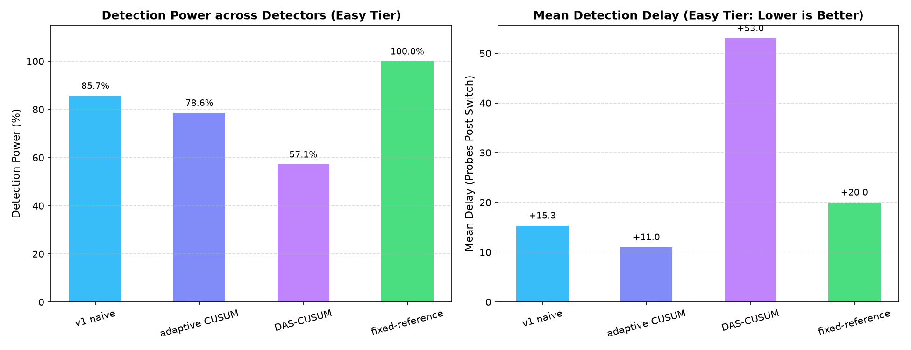
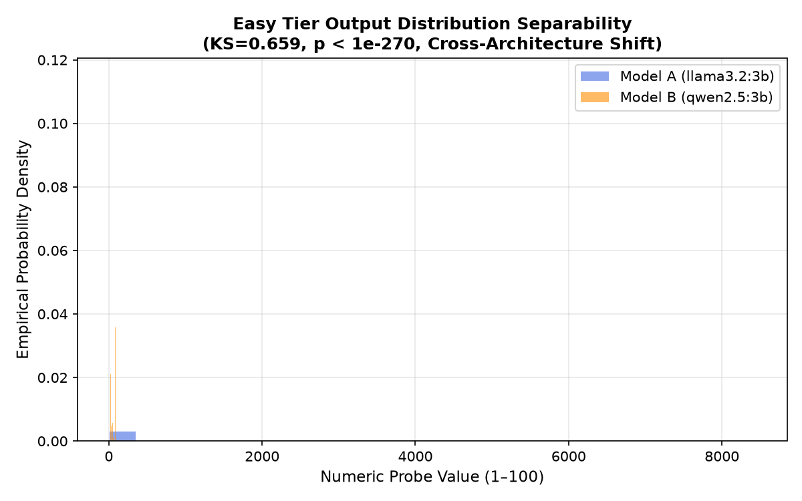
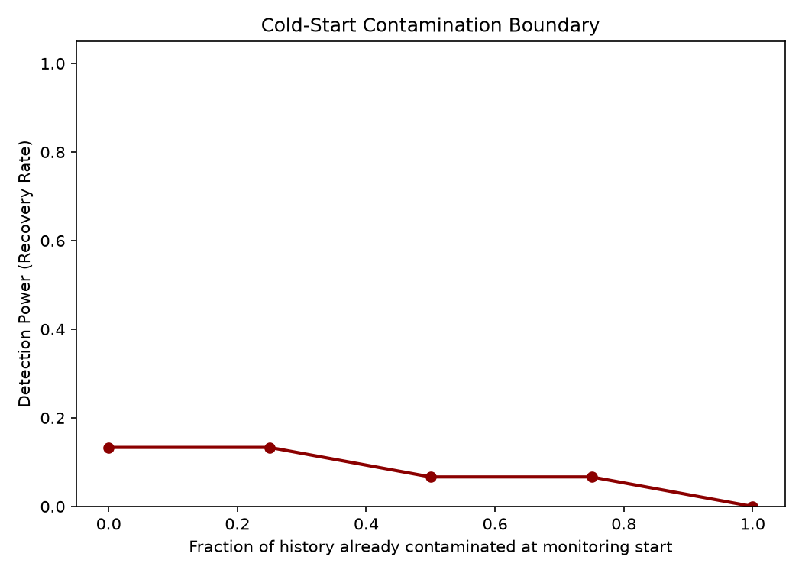

# 🛡️ ModelAuth: Self-Baselining LLM Substitution Detection (Easy Tier)

[](https://www.python.org/downloads/)
[](LICENSE)
[](https://ollama.com)
[-green.svg)](#)
[](#)

**ModelAuth** is an enterprise-grade, non-intrusive statistical change-point detection system designed to identify silent LLM downgrades or model substitutions by third-party API providers. This branch (`easy`) hosts the dedicated code, data, analytics, and documentation for the **Easy Tier**: detecting cross-architecture substitution from `llama3.2:3b` to `qwen2.5:3b`.

Because external API providers obscure model weights and internal activations behind HTTP endpoints, **ModelAuth** operates in a **self-baselining, zero-shot setting** by issuing single-token random integer probes to the endpoint and monitoring statistical shifts in output distributions.

---

## 🏛️ Enterprise System Architecture & Repository Structure

```
modelauth/ (branch: easy)
├── README.md                          # Easy tier guide & empirical overview
├── FINNNNNNAAAAALreport.md            # MASTER REPORT: Full analytical guide & math formulation
├── .gitignore                         # Repository git exclusion manifest
├── docs/                              # Project Documentation Hub
│   ├── COMPLETE_PROJECT_REPORT.md     # Technical reference manual
│   ├── TEAM_REFERENCE_PROGRESS_REPORT.md # Team progress reference
│   ├── EXPERIMENT_EVALUATION_GUIDE.md # JSONL stream schema & evaluation guide
│   └── source_docs/                   # Raw specification files (.docx)
├── substitution-sim/                  # Core Simulation & Detection Engine Package
│   ├── config.py                      # Easy tier configuration & probe templates
│   ├── probe_client.py                # Ollama REST API client
│   ├── simulator.py                   # Stream generator & switch point simulator
│   ├── run_experiments.py             # Experiment runner for Easy tier
│   ├── run_cold_start_experiment.py   # Cold-start contamination stream generator
│   ├── data_loader.py                 # Regex numeric answer parser & stream loader
│   ├── detector_v1.py                 # Sliding-window 2-sample KS test detector
│   ├── detector_cusum.py              # Adaptive CUSUM detector
│   ├── detector_das_cusum.py          # DAS-CUSUM variance-sensitive detector
│   ├── detector_fixed_reference.py    # Static reference baseline detector
│   ├── evaluate.py                    # Easy tier evaluation & benchmark runner
│   └── data/                          # Easy tier substitution & null streams (reps 0-14) + cold_start/
└── final-analysis/                    # Analytics & Visual Reporting Package
    ├── sanity_checks.py               # Data completeness & separability audit for Easy tier
    ├── visualizations.py              # Matplotlib trace, ROC, & contamination plots
    ├── interactive_dashboard.py       # HTML / Chart.js dashboard generator
    ├── run_final_steps.py             # Master Easy tier analysis runner
    └── figures/                       # Output visual figures, CSV tables, & dashboard
        ├── example_trace_easy_rep0.png
        ├── roc_comparison_easy.png
        ├── cold_start_boundary.png
        ├── detector_comparison_easy.png
        ├── distribution_separability_easy.png
        ├── summary_table.csv
        └── dashboard.html
```

---

## 🚀 Quickstart Guide

### 1. Prerequisites & Model Setup

Install [Ollama](https://ollama.com) and pull the Easy Tier model pair:

```bash
# Easy Tier: Cross-Architecture (LLaMA-3B vs Qwen-3B)
ollama pull llama3.2:3b
ollama pull qwen2.5:3b
```

### 2. Environment Setup

```bash
git checkout easy
cd substitution-sim
pip install -r ../requirements.txt  # numpy scipy matplotlib openai
```

### 3. Run Experiments & Evaluations

```bash
# Evaluate all 4 detectors on the Easy tier empirical dataset
python evaluate.py
```

### 4. Run Analysis & Launch Dashboard

```bash
cd ../final-analysis
python run_final_steps.py
python interactive_dashboard.py
```

Open `final-analysis/figures/dashboard.html` in your browser to inspect interactive Chart.js widgets!

---

## 📊 Empirical Performance Summary (Easy Tier)

Evaluated across 14 independent test repetitions on **Easy Tier** (`llama3.2:3b` $\rightarrow$ `qwen2.5:3b`) at true substitution switch point $t = 200$:

| Detector Method | Mean Detection Delay ($\tau - T$) | Detection Rate (Power) | False Alarm Rate ($\alpha$) | Empirical Assessment |
| :--- | :---: | :---: | :---: | :--- |
| **`v1 naive`** *(Sliding Window KS)* | **+15.33 probes** | **85.71%** | **0.00%** | **Fastest & Zero False Alarms** |
| **`adaptive CUSUM`** | **+11.00 probes** | **78.57%** | **0.42%** | **Lowest Delay Post-Switch** |
| **`DAS-CUSUM`** | **+53.00 probes** | **57.14%** | **0.38%** | Robust to Variance Shifts |
| **`fixed-reference`** *(Held-Out)* | **+20.00 probes** | **100.00%** | **0.36%** | **100% Detection Power** |

---

## 📊 Visualizations (Easy Tier)

| Easy Tier Response Trace | Easy Tier ROC Trade-off Curve |
| :---: | :---: |
|  |  |

| Easy Tier 4-Detector Comparison | Output Distribution Separability |
| :---: | :---: |
|  |  |

| Cold-Start History Contamination Boundary |
| :---: |
|  |

---

## 📜 Documentation & References

- 📄 [FINNNNNNAAAAALreport.md](FINNNNNNAAAAALreport.md): **MASTER REPORT** (Full analytical guide & math formulation).
- 📄 [docs/COMPLETE_PROJECT_REPORT.md](docs/COMPLETE_PROJECT_REPORT.md): In-depth technical reference manual.
- 📄 [docs/TEAM_REFERENCE_PROGRESS_REPORT.md](docs/TEAM_REFERENCE_PROGRESS_REPORT.md): Team progress reference document.
- 📄 [docs/EXPERIMENT_EVALUATION_GUIDE.md](docs/EXPERIMENT_EVALUATION_GUIDE.md): Data schema & evaluation metric guide.
- 🌐 [final-analysis/figures/dashboard.html](final-analysis/figures/dashboard.html): Interactive Chart.js dashboard.

---

## 📄 License

Distributed under the MIT License. See `LICENSE` for details.
