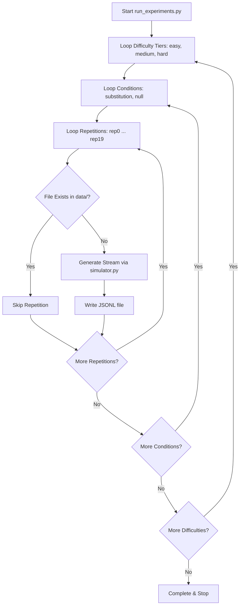
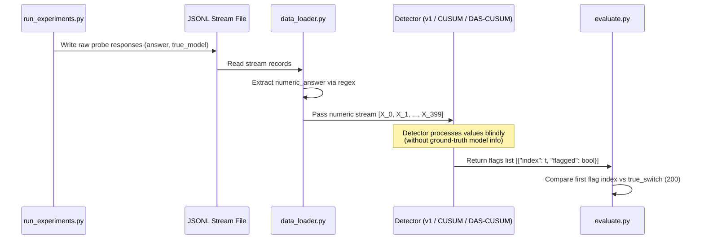
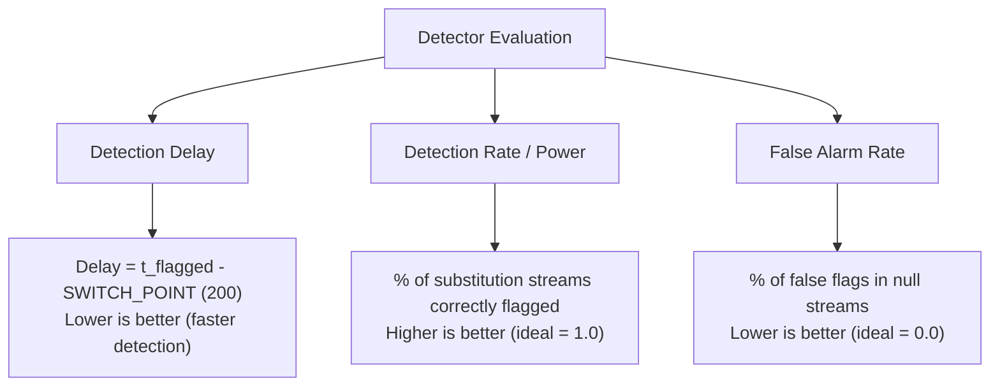

# LLM Substitution Detection: Experiment Lifecycle & Evaluation Guide

This document provides a comprehensive explanation of how `run_experiments.py` operates, when it terminates, how the generated `.jsonl` data streams are structured, and how this data is used to evaluate model substitution detectors.

---

## 1. When Does `run_experiments.py` Stop?

`run_experiments.py` is a deterministic simulation harness that generates probe response datasets for statistical change-point detection. 

### Execution & Termination Logic

The script loops through three nested configurations defined in `config.py`:

1. **Difficulty Tiers** (`easy`, `medium`, `hard` model pairs)
2. **Test Conditions**:
   - `substitution`: The endpoint silently switches from `model_a` to `model_b` at request index `SWITCH_POINT` (default: `200`).
   - `null`: Control condition where `model_a` serves all `TOTAL_REQUESTS` (default: `400`) continuously with **no switch**.
3. **Repetitions** (`N_REPETITIONS` = 20 runs per condition).



### Stopping Criteria

- **Total Files Target**: `3 difficulties × 2 conditions × 20 repetitions = 120 .jsonl files`.
- **Resumability**: On each iteration, it checks `if os.path.exists(fname): continue`. If a run is interrupted, re-executing `run_experiments.py` resumes from the last missing file.
- **Completion**: Once all 120 `.jsonl` files exist in `substitution-sim/data/`, the script finishes execution and exits cleanly.

---

## 2. `.jsonl` Data Stream Structure

Each `.jsonl` file represents a single, independent observation stream containing `TOTAL_REQUESTS` (400) line-delimited JSON objects.

### Sample Line from a `.jsonl` File

```json
{
  "index": 199,
  "prompt": "Pick a random number between 1 and 100. Reply with only the number.",
  "answer": "42",
  "true_model": "llama3.2:3b",
  "failed": false
}
```

### Field Breakdown

| Field | Type | Description |
| :--- | :--- | :--- |
| `index` | Integer | Request sequence index ($t \in [0, 399]$). |
| `prompt` | String | Randomly selected probe template from `PROBE_TEMPLATES`. |
| `answer` | String | Raw text output produced by the LLM. |
| `true_model` | String | Ground-truth model ID serving the request (**hidden from detector**). |
| `failed` | Boolean | `true` if network/API probe failed; `false` otherwise. |

---

## 3. How `.jsonl` Data Enables Model Substitution Evaluation

### The Core Problem: Detecting Silent Model Swapping

When an API provider secretly downgrades or swaps an LLM (e.g., replacing `llama3.2:3b` with a cheaper model like `qwen2.5:3b`), the change is non-transparent. However, different LLMs exhibit distinct intrinsic probability distributions in their single-token output distributions (e.g., number preference bias, mean, variance, entropy).

```
Observations: X_0, X_1, ..., X_199 ~ Distribution P_A (Model A)
              ---------------------------------------------------
              [ SWITCH POINT at t = 200 ]
              ---------------------------------------------------
Observations: X_200, X_201, ..., X_399 ~ Distribution P_B (Model B)
```

### Data Pipeline & Evaluation Flow



---

## 4. Visualizing Distribution Shifts & Detector Flags

### Response Distribution Shift at $t = 200$

Below is a conceptual visualization of how numeric probe answers shift when substitution occurs at $t = 200$:

```
Numeric Response Value
  100 |     •   •      •             o   o     o    o    o 
   80 |  •         •      •        o       o     o     o
   60 |       •       •        •      o      o     o     o
   40 |  •  •    •  •    •  •        o    o     o     o
   20 |    •       •       •       o        o     o
    0 +----------------------------|--------------------------> Request Index (t)
      0                           200                      400
      |<--- Model A (Distribution P_A) --->|<--- Model B (Distribution P_B) --->|
                                   ^
                           Substitution Point
```

- **Before $t=200$**: Probe answers reflect Model A's distribution parameters ($\mu_A, \sigma_A^2$).
- **After $t=200$**: Probe answers shift to Model B's distribution parameters ($\mu_B, \sigma_B^2$).

---

## 5. Metrics Used for Evaluation in `evaluate.py`

By testing detectors across all 20 repetitions of `substitution` streams and `null` control streams, we compute three key metrics:



### Metrics Formula Summary

1. **Mean Detection Delay**:
   $$\text{Mean Delay} = \frac{1}{N_{\text{detected}}} \sum_{i \in \text{detected}} (\tau_i - T_{\text{switch}})$$
   *Measures how quickly the detector flags a model swap after it occurs.*

2. **Detection Rate (Statistical Power)**:
   $$\text{Detection Rate} = \frac{\text{Count of substitution runs where } \tau \text{ was flagged}}{\text{Total substitution repetitions } (20)}$$
   *Measures the probability of successfully detecting a real substitution.*

3. **Mean False Alarm Rate ($\alpha$-error)**:
   $$\text{False Alarm Rate} = \frac{\text{Count of false positive flags in null streams}}{\text{Total evaluation windows in null streams}}$$
   *Measures how often the detector falsely accuses a provider of model swapping when none occurred.*

---

## 6. Summary: Why This Approach Works

1. **Self-Baselining**: No access to model weights or logprobs is required. The framework learns the baseline distribution directly from initial live probes.
2. **Ground-Truth Benchmarking**: The `.jsonl` structure retains `true_model` and exact timing (`switch_point`), allowing quantitative comparison across algorithms (KS-test, Adaptive CUSUM, DAS-CUSUM).
3. **Statistical Rigor**: By running 20 repetitions per condition, evaluation metrics smooth out random LLM sampling noise, yielding reliable confidence intervals.
