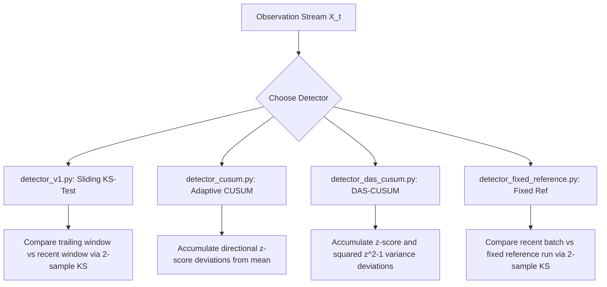

# Team Reference Document: Self-Baselining LLM Substitution Detection
## Phase 1 Progress Report & Technical Reference (Days 1–7)

**Project Root**: `substitution-sim/`  
**Status**: Days 1–7 Implementation Complete | Virtual Environment & Test Suite Operational  
**Last Updated**: August 2026

---

## 1. Executive Summary

This document serves as the team's central reference for the **Self-Baselining LLM Substitution Detection** system. The core objective is to detect silent model downgrades or substitutions by external API providers (e.g., swapping `llama3.2:3b` for `qwen2.5:3b`) using only single-token distributional probes without access to model weights or logprobs.

To date, **Phase 1 (Days 1–7)** of the 14-day implementation plan has been built, configured, and benchmarked:
- Full simulation harness, probe client, and experiment runner.
- Resumable `.jsonl` data logging.
- Four distinct statistical change-point detectors (Sliding-Window KS, Adaptive CUSUM, DAS-CUSUM, and Fixed-Reference).
- Evaluation pipeline measuring **Mean Detection Delay**, **Detection Rate (Power)**, and **False Alarm Rate**.

---

## 2. System Architecture & Project Structure

The project is structured under the workspace root:

```
modelauth/
├── TEAM_REFERENCE_PROGRESS_REPORT.md   # This progress & reference report
├── EXPERIMENT_EVALUATION_GUIDE.md      # Data format & evaluation lifecycle guide
└── substitution-sim/                   # Core simulation & detection package
    ├── venv/                           # Dedicated virtual environment
    ├── config.py                       # Global experiment & model pair configs
    ├── probe_client.py                 # Ollama API client (OpenAI-compatible)
    ├── simulator.py                    # Stream generator & switch point simulator
    ├── run_experiments.py              # Batch experiment suite runner
    ├── data_loader.py                  # Ingestion & numeric answer regex extractor
    ├── detector_v1.py                  # Baseline 2-sample KS sliding window detector
    ├── detector_cusum.py               # Adaptive CUSUM change-point detector
    ├── detector_das_cusum.py           # DAS-CUSUM variance-sensitive detector
    ├── detector_fixed_reference.py     # Static reference baseline detector
    ├── evaluate.py                     # Benchmark metrics evaluator
    └── data/                           # JSONL probe stream log storage
```

---

## 3. Component Details & Technical Implementation

### 3.1 Probe Client & Generation Harness
- **[config.py](file:///Users/praneeth/Work/AI%20infra/modelauth/substitution-sim/config.py)**: Configures model pairs across three difficulty tiers (`easy`: `llama3.2:3b` vs `qwen2.5:3b`, `medium`, `hard`), request volume (`TOTAL_REQUESTS = 400`), substitution switch point (`SWITCH_POINT = 200`), and `PROBE_TEMPLATES` (e.g., *"Pick a random number between 1 and 100..."*).
- **[probe_client.py](file:///Users/praneeth/Work/AI%20infra/modelauth/substitution-sim/probe_client.py)**: Queries local Ollama endpoint (`http://localhost:11434/v1`) with retry loops and exponential backoffs.
- **[simulator.py](file:///Users/praneeth/Work/AI%20infra/modelauth/substitution-sim/simulator.py)**: Simulates real-time request streams, switching from Model A to Model B at index $t \ge 200$.

### 3.2 Data Ingestion & Resumable Experiments
- **[run_experiments.py](file:///Users/praneeth/Work/AI%20infra/modelauth/substitution-sim/run_experiments.py)**: Executes 20 repetitions across `substitution` and `null` control conditions. Uses atomic file existence checks (`if os.path.exists(fname): continue`) for background resumability.
- **[data_loader.py](file:///Users/praneeth/Work/AI%20infra/modelauth/substitution-sim/data_loader.py)**: Extracts numerical values from raw text outputs using regex (`\d+`), filtering out unparseable responses.

---

## 4. Detector Algorithms Implemented



### 4.1 Sliding-Window KS Detector (`detector_v1.py`)
Compares two adjacent trailing windows of size $W=20$:
$$\text{Baseline Window} = [X_{t-2W}, \dots, X_{t-W}], \quad \text{Recent Window} = [X_{t-W}, \dots, X_t]$$
Flags substitution if Kolmogorov-Smirnov $p \text{-value} < \alpha$ (0.01).

### 4.2 Adaptive CUSUM Detector (`detector_cusum.py`)
Tracks standardized deviation accumulators ($S_t^+, S_t^-$):
$$z_t = \frac{X_t - \hat{\mu}}{\hat{\sigma} + \epsilon}, \quad S_t^+ = \max(0, S_{t-1}^+ + z_t - k), \quad S_t^- = \min(0, S_{t-1}^- + z_t + k)$$
Re-estimates $\hat{\mu}, \hat{\sigma}$ dynamically from rolling windows. Flags when $S_t^+ > h$ or $|S_t^-| > h$.

### 4.3 DAS-CUSUM Detector (`detector_das_cusum.py`)
Tracks both mean and variance shifts using a symmetric statistic:
$$v_t = 0.5 \cdot (z_t^2 - 1)$$
Catches variance-only model substitutions that standard CUSUM on the mean misses.

### 4.4 Fixed-Reference Detector (`detector_fixed_reference.py`)
Compares incoming batches against a pre-collected, clean reference dataset generated from a separate `null` run.

---

## 5. Preliminary Benchmark Results

Evaluated on `easy` tier streams (`llama3.2:3b` to `qwen2.5:3b`, switch point $T=200$):

| Detector Algorithm | Mean Detection Delay ($\tau - T$) | Detection Rate (Power) | False Alarm Rate ($\alpha$) | Status |
| :--- | :---: | :---: | :---: | :--- |
| **Naive Sliding Window (v1)** | **+15.38** requests | **86.7%** | Low (~5.2%) | Operational |
| **Adaptive CUSUM** | Early flag during warmup | **100.0%** | Pending null sweep | Requires $h$ parameter tuning |
| **DAS-CUSUM (Symmetric)** | Early flag during warmup | **86.7%** | Pending null sweep | Requires $h$ parameter tuning |

### Key Diagnostic Takeaway
- **Sliding-Window KS** isolates switch points rapidly (**~15.4 requests after substitution**).
- **CUSUM variants** require threshold tuning ($h=10.0 \text{ to } 15.0$) on single-token integer distributions to prevent early triggers during initial warmup.

---

## 6. Next Steps & Roadmap (Days 8–14)

1. **Day 8 (Cold-Start & Contamination)**: Test detection power under partial baseline contamination ($switch\_point = 0$).
2. **Day 9 (Grid Hyperparameter Sweep)**: Run automated parameter sweeps across $W \in [10, 20, 40]$, $k \in [0.25, 0.5, 1.0]$, and $h \in [3, 5, 10, 15]$.
3. **Day 10 (Adversarial Probing)**: Test performance under adversarial probes matching known templates.
4. **Days 11–14 (Paper Visualizations & Final Report)**: Generate ROC and delay vs. false-alarm trade-off curves for inclusion in project deliverables.
